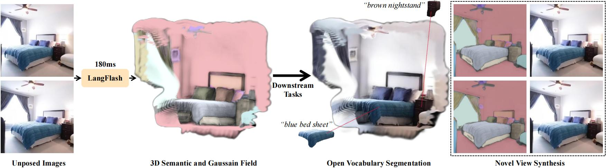

# [CVPRF 2026] LangFlash: Feed-forward 3D Language Gaussian Splatting from Sparse Unposed Images

Yilong Liu, Wanhua Li, Chen Zhu-Tian, Hanspeter Pfister

[[Paper](https://arxiv.org/abs/2605.23287)] [[Project Page](https://liylo.github.io/langflash.github.io/)]



LangFlash is a feed-forward framework for 3D language Gaussian splatting from sparse, unposed input images.

## Installation

Create a Python 3.10 environment and install the required dependencies (other torch version should work):

```bash
conda create -y -n langflash python=3.10
conda activate langflash
pip install torch torchvision torchaudio --index-url https://download.pytorch.org/whl/cu126
pip install -r requirements.txt
```

## Pre-trained Checkpoints

Download the geometry and semantic checkpoints, then place both files in `ckpt/`:

- [Geometry checkpoint](https://huggingface.co/botaoye/NoPoSplat/resolve/main/mixRe10kDl3dv.ckpt): `ckpt/mixRe10kDl3dv.ckpt` （From [NoPoSplat](https://github.com/cvg/NoPoSplat))
- [Semantic checkpoint](https://huggingface.co/li2231/LangFlash/resolve/main/re10k.ckpt): `ckpt/re10k.ckpt`

The final directory layout should look like this:

```text
ckpt/
  mixRe10kDl3dv.ckpt
  re10k.ckpt
```

## Demo

Run the Gradio demo with:

```bash
python -m LangFlash.model.gradio
```

The demo uses the bundled examples under `sample/` and loads checkpoints from `ckpt/`.

## Dataset

The preprocessed dataset is available on [Hugging Face](https://huggingface.co/datasets/li2231/LangFlash_Dataset/).

The dataset release contains:

```text
scannet_extracted_sp   ScanNet data and metadata
clip_test              RE10K test language features and corresponding masks
clip_train_part{i}      RE10K training language features and corresponding masks
```

## Acknowledgements

This project builds on several excellent open-source projects:[NoPoSplat](https://github.com/cvg/NoPoSplat),[EfficientViT](https://github.com/mit-han-lab/efficientvit),[LangSplat](https://github.com/minghanqin/LangSplat),[SAM2](https://github.com/facebookresearch/sam2),[lseg-minimal](https://github.com/krrish94/lseg-minimal), and [FG-CLIP](https://github.com/360CVGroup/FG-CLIP).

## Citation

If you find LangFlash useful, please cite:

```tex
@misc{liu2026langflash,
  title         = {LangFlash: Feed-forward 3D Language Gaussian Splatting from Sparse Unposed Images},
  author        = {Yilong Liu and Wanhua Li and Chen Zhu-Tian and Hanspeter Pfister},
  year          = {2026},
  eprint        = {2605.23287},
  archivePrefix = {arXiv},
  primaryClass  = {cs.CV}
}
```
